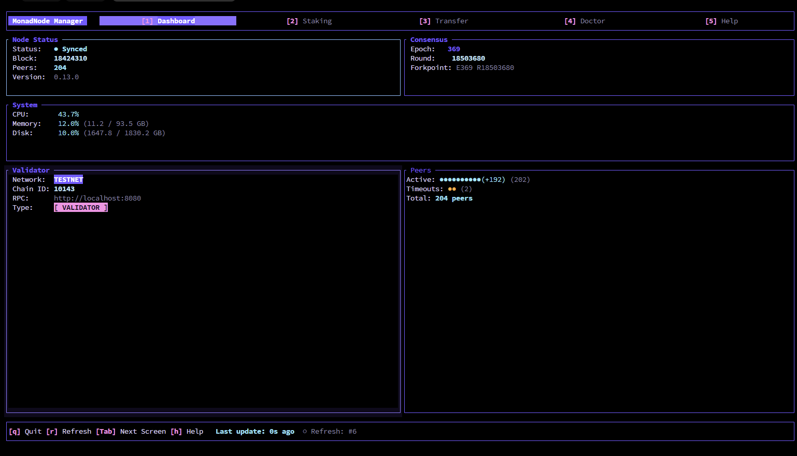
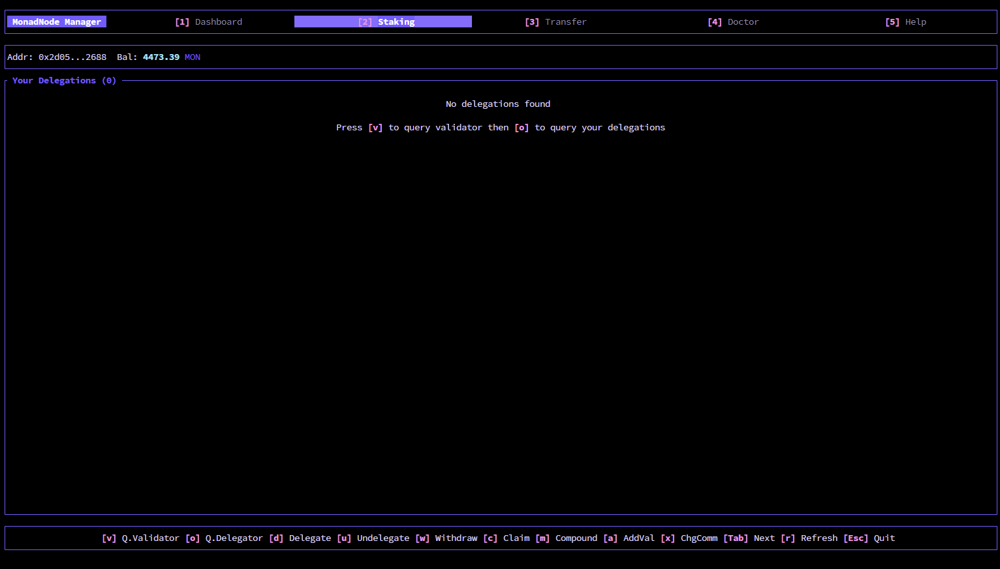
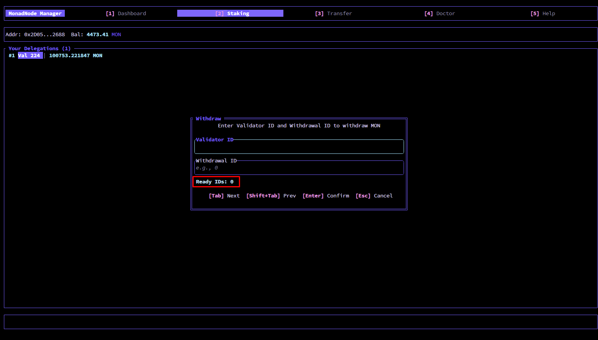
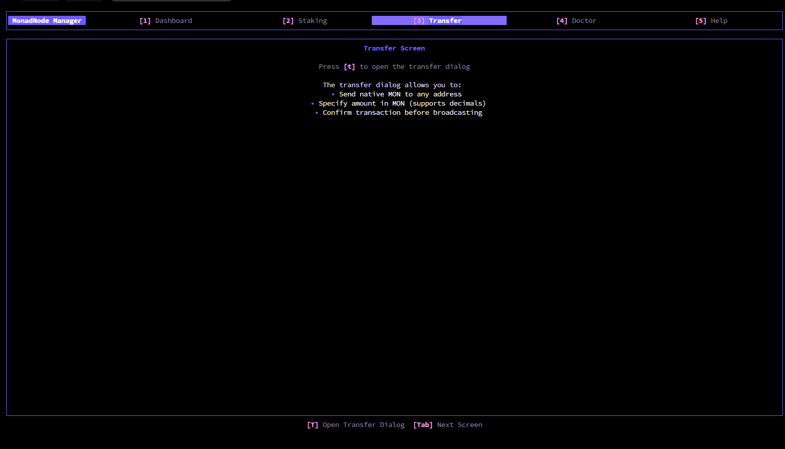
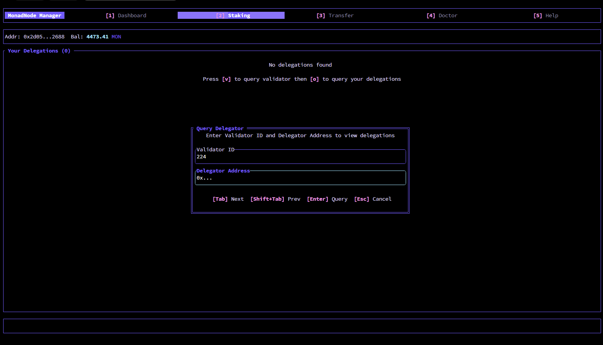
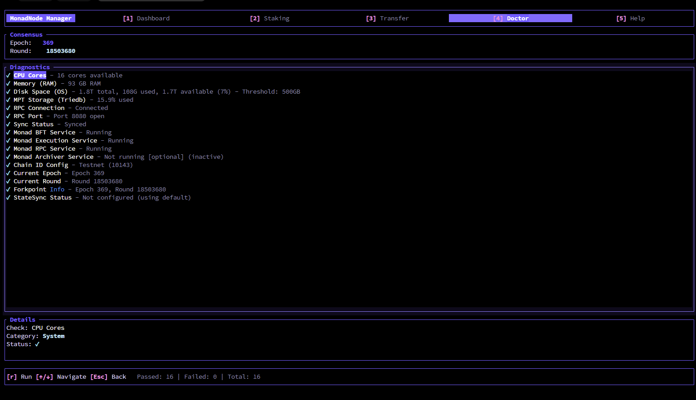
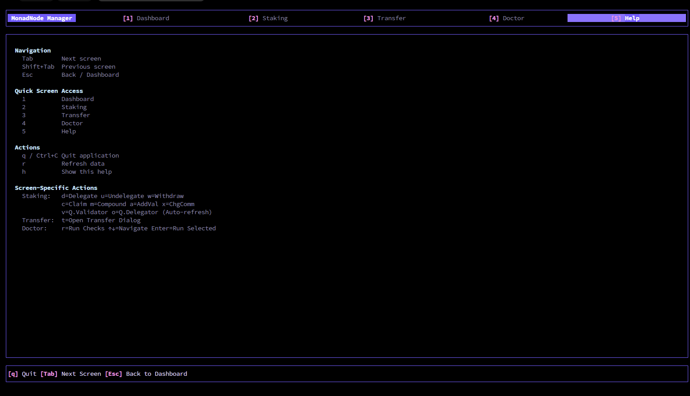

# Monad Validator Manager

[](https://github.com/MictoNode/monad-val-manager/releases)
[](LICENSE-MIT)
[](https://www.rust-lang.org)
[](https://github.com/MictoNode/monad-val-manager/actions)

<p align="center">
  <strong>Professional CLI and TUI tool for Monad blockchain validator node management</strong>
</p>

<p align="center">
  <a href="#features">Features</a> •
  <a href="#installation">Installation</a> •
  <a href="#quick-start">Quick Start</a> •
  <a href="#staking-commands">Staking Commands</a> •
  <a href="#configuration">Configuration</a> •
  <a href="#support">Support</a>
</p>

---

## Features

- **TUI Dashboard** - 5 screens (Dashboard, Staking, Transfer, Doctor, Help) with Monad purple theme, real-time block counter, and live metrics
- **Doctor Diagnostics** - 16 automated checks with actionable error detection and fix recommendations
- **Staking Operations** - Complete staking management: delegate, undelegate, withdraw (2-epoch delay), claim rewards, compound rewards
- **Validator Management** - Add new validators (100k MON minimum), change commission rates (0-100%)
- **Query Operations** - Query validators, delegators, epochs, validator-sets, proposers, delegations, gas estimates
- **Hardware Wallet Support** - Ledger device integration via `alloy-signer-ledger` (built-in, untested - please share feedback)
- **Multi-network Support** - Switch between mainnet (chain ID 143) and testnet (chain ID 10143)
- **Transfer** - Native MON token transfers with dry-run mode for safe testing

---

## Installation

### Requirements

- **Ubuntu 24.04 LTS** (or compatible Linux distribution)
- **Running Monad node** with RPC endpoint at `localhost:8080`

### Option 1: Download Pre-built Binary (Recommended)

Download the latest release for your platform from the [Releases page](https://github.com/MictoNode/monad-val-manager/releases):

#### Linux

```bash
# 1. Download the binary
wget https://github.com/MictoNode/monad-val-manager/releases/latest/download/monad-val-manager

# 2. Make it executable
chmod +x monad-val-manager

# 3. Move to a directory in your PATH (optional)
sudo mv monad-val-manager /usr/local/bin/

# 4. Verify installation
monad-val-manager --version
```

#### Verify Download Integrity

Each release includes SHA256 checksums. Verify your download:

```bash
# Check the SHA256 hash
sha256sum monad-val-manager

# Compare with the hash shown on the Releases page
```

### Option 2: Build from Source

<details>
<summary>Click to expand build instructions</summary>

#### Prerequisites

- **Rust 1.93+** - Install via [rustup](https://rustup.rs/)

```bash
# Install Rust (if not already installed)
curl --proto '=https' --tlsv1.2 -sSf https://sh.rustup.rs | sh
source $HOME/.cargo/env
```

#### Build Steps

```bash
# Clone the repository
git clone https://github.com/MictoNode/monad-val-manager.git
cd monad-val-manager

# Build in release mode (optimized binary)
cargo build --release

# The binary will be at:
# ./target/release/monad-val-manager

# Optional: Install system-wide
cargo install --path .
```

Ledger support is enabled by default. The tool will automatically detect Ledger devices when connected.

</details>

---

## Quick Start

> **⚠️ First time user?** Test on testnet first. Select `testnet` when running `monad-val-manager init`. Mainnet transactions cannot be reversed.

### 1. Initialize Configuration

```bash
# Initialize configuration (REQUIRED - creates config and .env)
monad-val-manager init

# Follow the prompts:
# - Select network (mainnet/testnet)
# - Enter your private key (hidden input)
# - Confirm RPC endpoint
```

**What `init` creates:**
- `~/.config/monad-val-manager/config.toml` - Configuration file
- `~/.config/monad-val-manager/.env` - Private key

### 2. Verify Installation

```bash
# Check version
monad-val-manager --version

# Run diagnostics
monad-val-manager doctor
```

### 3. Start Using the Tool

```bash
# Launch the TUI dashboard (interactive monitoring)
monad-val-manager

# Check node status
monad-val-manager status

# View all available commands
monad-val-manager --help
```

### Configuration Location

After initialization, your config is stored at:

| Linux | `~/.config/monad-val-manager/config.toml` |

No manual configuration is needed to get started - just run the tool!

---

## Documentation

| Document | Description |
|----------|-------------|
| [CLI Reference](docs/cli-reference.md) | Complete CLI command bank (all commands with parameters & examples) |
| [Command Reference](docs/command-reference.md) | Quick command reference |
| [Validator Onboarding](docs/validator-onboarding.md) | Step-by-step validator registration guide |

---

## Staking Commands

> **📖 Complete CLI Reference:** See [docs/cli-reference.md](docs/cli-reference.md) for the complete CLI command bank with all parameters, examples, and usage patterns.

> **🔧 Validator Onboarding:** See [docs/validator-onboarding.md](docs/validator-onboarding.md) for step-by-step validator registration guide.

### Quick Examples

```bash
# Delegate MON to a validator
monad-val-manager stake delegate --validator-id 1 --amount 1000

# Claim rewards
monad-val-manager stake claim-rewards --validator-id 1

# Query validator info
monad-val-manager stake query validator --id 1

# View all commands
monad-val-manager --help
```

---

## TUI Dashboard

The interactive dashboard provides real-time monitoring with Monad brand theme.

### Dashboard Screen



Real-time node status, block counter, consensus info, and system metrics.

### Staking Screen



All staking operations in one place: delegate, undelegate, withdraw, claim rewards, and compound.



Withdraw dialog shows "Ready to Withdraw" indicator (red box) when the 2-epoch delay has passed and funds are available for withdrawal.

### Transfer Screen



Native MON token transfers with recipient address and amount input.

### Dialog Examples



Clean dialog interfaces for user input with Monad brand styling.

### Doctor Screen



16 diagnostic checks with status indicators and recommendations.

### Help Screen



Complete keybinding reference and shortcuts.

**Screens Summary:** Dashboard (node status) • Staking (operations) • Transfer (MON) • Doctor (diagnostics) • Help (shortcuts)

---

## Terminal Compatibility

### Recommended Terminals

| Terminal | Compatibility | Notes |
|----------|---------------|-------|
| **Termius** | ✅ Full compatibility | Backspace and paste work correctly |
| **MobaXterm** | ⚠️ Requires configuration | Set **Terminal → Keyboard → "Backspace key sends"** to **DEL (^?)**, then restart |
| **Windows Terminal** | ✅ Compatible | Works well on Windows |
| **iTerm2** | ✅ Compatible | Works well on macOS |
| **Terminal.app** | ✅ Compatible | Default macOS terminal |
| **GNOME Terminal** | ✅ Compatible | Default on many Linux distros |

> **Note:** For other SSH clients with backspace issues, change the backspace setting to send **DEL (^?)** instead of **^H**, or use Termius.

---

## Configuration

### Security

> **⚠️ Warning:** Your `.env` file contains your private key. **Never:**
> - Commit it to git (verify it's in `.gitignore`)
> - Share it with anyone
> - Display it in logs or error messages
>
> **Production:** We recommend using a Ledger hardware wallet for enhanced security.

### Auto-Generated Configuration

The configuration file is **automatically created** on first run with sensible defaults. You only need to edit it for:

- Changing RPC endpoint (if not using localhost:8080)
- Setting custom private key location

### Default Configuration

```toml
[network]
type = "mainnet"  # or "testnet"
chain_id = 143    # mainnet=143, testnet=10143

[rpc]
http_url = "http://localhost:8080"
ws_url = "ws://localhost:8080"
timeout = 30
max_retries = 3
```

### Environment Variables

Create a `.env` file in your project directory or home directory:

```bash
# Private key for signing transactions
PRIVATE_KEY=your_private_key_here

# RPC URL (optional, overrides config)
RPC_URL=http://localhost:8080
```

### View Current Configuration

```bash
monad-val-manager config-show
```

### Recreate Configuration

```bash
monad-val-manager init
```

---

## Doctor Diagnostics

Run diagnostic checks to identify common issues:

```bash
# Run all diagnostics
monad-val-manager doctor
```

The tool performs 16 automated checks including node connectivity, RPC availability, sync status, system resources, and configuration validity.

> **See [docs/cli-reference.md](docs/cli-reference.md) for detailed documentation.**

---

## Hardware Wallet Support

Ledger hardware wallet support is built-in via `alloy-signer-ledger`.

> **Note:** This feature has not been tested yet. If you test it with a Ledger device, please open an issue and share your experience.

---

## Troubleshooting

### "Connection refused" error

- Ensure your Monad node is running
- Check the RPC endpoint in your config (`config-show`)
- Verify the node is listening on `localhost:8080`

### Private key not found

- Ensure `.env` file exists with `PRIVATE_KEY` variable
- Or set `PRIVATE_KEY` environment variable
- Key should be 64 hex characters (without 0x prefix)

### Run diagnostics

```bash
# Check for common issues
monad-val-manager doctor
```

---

## Support

- **Issues**: [GitHub Issues](https://github.com/MictoNode/monad-val-manager/issues)
- **Releases / Changelog**: [GitHub Releases](https://github.com/MictoNode/monad-val-manager/releases)
- **Documentation**: [docs/](docs/) folder for detailed guides

---

## Acknowledgments

This project is inspired by and maintains contract parity with the official [Monad Staking SDK CLI](https://github.com/monad-developers/staking-sdk-cli). The Python SDK serves as the reference implementation for all staking operations and transaction encoding.

---

## License

Licensed under either of [Apache License, Version 2.0](LICENSE-APACHE) or [MIT license](LICENSE-MIT) at your option.

---

<p align="center">
  Made with ❤️ for Monad validators
</p>
